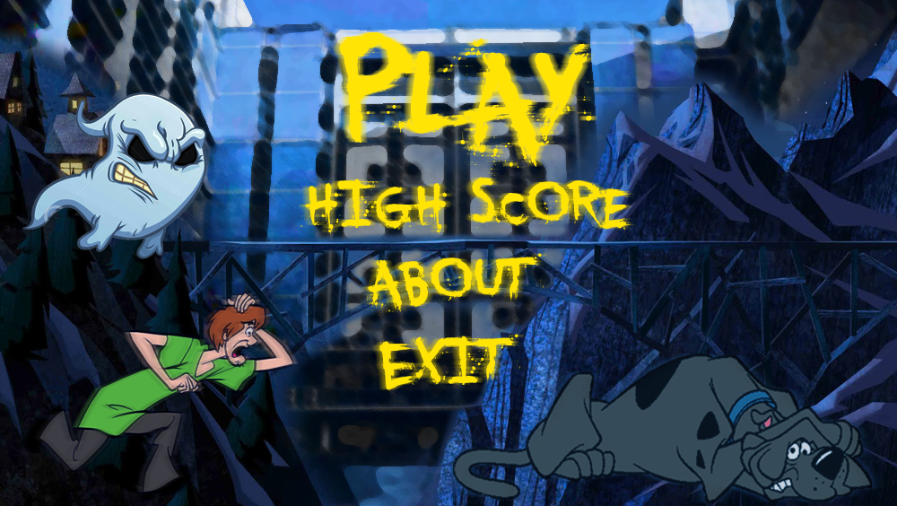
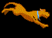

# Game Development Project (1.2)

## Tools used  : Visual Studio, Photoshop

## Library used: IGraphics

This is a simple **2D game**, where you'll have to kill zombies to stay alive. Kill zombies to get more points. Get the heart to gain **+15** health! The longer you stay alive, the harder it becomes to survive!

### Cover:

## Main Menu

## Characters:

### Scooby:

### Ghost:

### Background:

